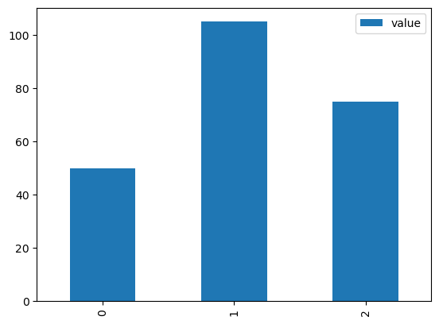
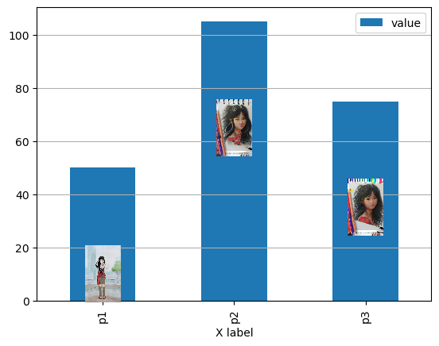

## Bar Plot Annotator

For now, the main goal of this project is to provide a tool to easily plot a bar chart from a pandas dataframe and add images to each bar. I plan on expanding the project to other types of charts. I want this tool to be simple to use, so it will do many things by default but I will also do my best to allow a high degree of customization when possible. 

Here are some images of what the tool does:

First, a simple bar chart using pandas' `df.plot` method:

and after using the tool, we get the following plot (many image parameters can be modified, such as size, position, border line, etc):

